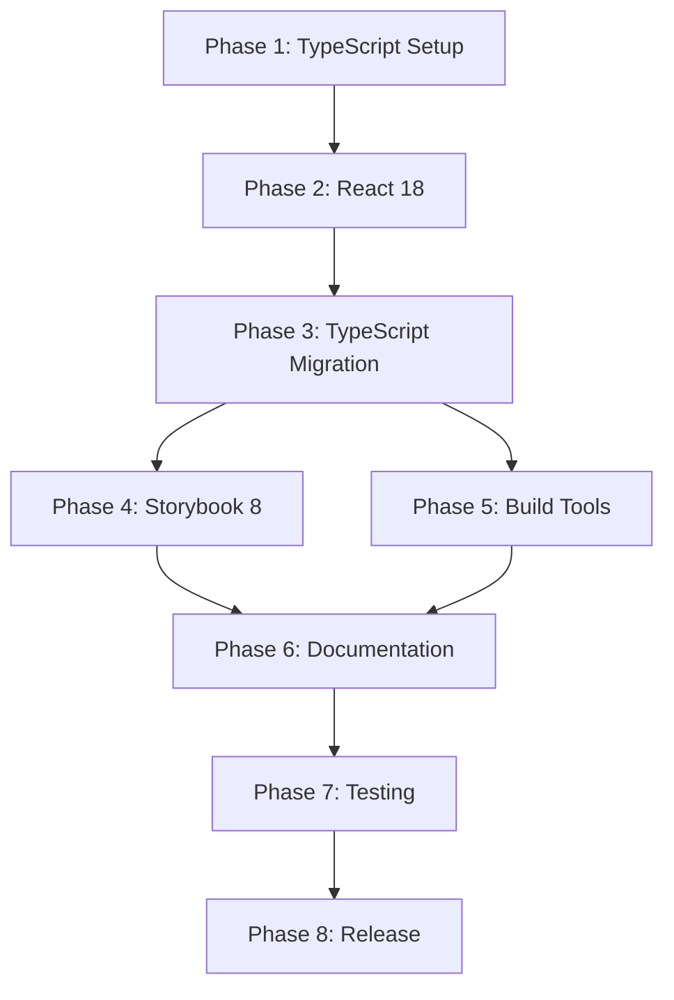

# NSW Design System React - Modernization Roadmap

## Executive Summary

This roadmap outlines the comprehensive modernization of the nsw-design-system-react library from its current state (React 17, JavaScript, Storybook 6.4) to a modern, type-safe, and maintainable codebase (React 18, TypeScript, Storybook 8).

**Current State:**
- React 17.0.2
- JavaScript (no TypeScript)
- Storybook 6.4.0 (not building)
- microbundle-crl build tool
- react-scripts 4.x

**Target State:**
- React 18.3.x
- Full TypeScript implementation
- Storybook 8.4.x with Vite
- Modern build tooling (tsup/Rollup)
- Updated test infrastructure

**Total Estimated Time:** 8-12 weeks

## Migration Phases

### Phase 1: Foundation Setup (Week 1-2)
**Goal:** Establish infrastructure without breaking existing functionality

#### 1.1 Repository Preparation
- [ ] Create feature branch: `feat/modernization`
- [ ] Document current build/test process
- [ ] Create baseline test coverage report
- [ ] Set up CI/CD for validation

#### 1.2 TypeScript Setup
- [ ] Install TypeScript dependencies
- [ ] Create `tsconfig.json`
- [ ] Configure build tools (tsup recommended)
- [ ] Update package.json exports
- [ ] Enable `.js` and `.ts` coexistence

**Dependencies:** None  
**Risk:** Low  
**Deliverable:** TypeScript compiles (even with no TS files yet)

### Phase 2: React 18 Upgrade (Week 2-3)
**Goal:** Update React before TypeScript migration

**Why before TypeScript?**
- React 18 types are different from React 17
- Avoid double-migration of type definitions
- Storybook 8 requires React 18

#### 2.1 Dependency Updates
- [ ] Update React to 18.3.x
- [ ] Update ReactDOM to 18.3.x
- [ ] Update testing libraries
- [ ] Update peer dependencies

#### 2.2 Code Updates
- [ ] Update ReactDOM.render → createRoot (example app)
- [ ] Test all components for React 18 compatibility
- [ ] Fix any Strict Mode issues
- [ ] Update useEffect patterns if needed

#### 2.3 Validation
- [ ] All existing tests pass
- [ ] Example app runs
- [ ] No console warnings

**Dependencies:** Phase 1 complete  
**Risk:** Medium (runtime behavior changes)  
**Deliverable:** React 18 working with JavaScript codebase

### Phase 3: TypeScript Migration (Week 3-6)
**Goal:** Convert all JavaScript to TypeScript

#### 3.1 Component Migration - Batch 1 (Week 3-4)
**Simple Components (10-15 components):**
- [ ] Button
- [ ] Alert
- [ ] Breadcrumbs
- [ ] Callout
- [ ] Tags
- [ ] Link List
- [ ] Section

**Process per component:**
1. Rename `.js` → `.tsx`
2. Define prop interfaces
3. Remove PropTypes
4. Add type annotations
5. Update tests
6. Update exports

#### 3.2 Component Migration - Batch 2 (Week 4-5)
**Form Components (7 components):**
- [ ] FormText
- [ ] FormCheckbox
- [ ] FormRadio
- [ ] FormSelect
- [ ] ProgressIndicator
- [ ] Form helper components

#### 3.3 Component Migration - Batch 3 (Week 5-6)
**Complex Components (remaining ~10 components):**
- [ ] Accordion
- [ ] Tabs
- [ ] Table
- [ ] Pagination
- [ ] Header/Masthead
- [ ] Footer
- [ ] MainNav
- [ ] HeroBanner
- [ ] Card
- [ ] Media

#### 3.4 Infrastructure Migration
- [ ] Update `src/index.js` → `src/index.ts`
- [ ] Export all types
- [ ] Update all test files
- [ ] Configure Jest for TypeScript
- [ ] Update ESLint for TypeScript

#### 3.5 Validation
- [ ] `tsc --noEmit` passes with zero errors
- [ ] All tests pass
- [ ] Build produces valid `.d.ts` files
- [ ] Type exports work for consumers

**Dependencies:** Phase 2 complete  
**Risk:** High (breaking changes possible)  
**Deliverable:** Fully typed TypeScript codebase

### Phase 4: Storybook Migration (Week 6-8)
**Goal:** Upgrade Storybook to version 8

**Why after TypeScript?**
- Storybook 8 CSF 3.0 works better with TypeScript
- Type-safe story definitions
- Better autocomplete and validation

#### 4.1 Automated Upgrade
- [ ] Run `npx storybook@latest upgrade`
- [ ] Review automated changes
- [ ] Fix any issues

#### 4.2 Configuration Migration
- [ ] Update `.storybook/main.js` → `.storybook/main.ts`
- [ ] Update `.storybook/preview.js` → `.storybook/preview.ts`
- [ ] Update `.storybook/manager.js` if needed
- [ ] Configure Vite builder
- [ ] Update addon configuration

#### 4.3 Story Migration - Batch 1 (Week 7)
**Simple Stories (first 10):**
- [ ] Convert to `.stories.tsx`
- [ ] Migrate to CSF 3.0
- [ ] Add autodocs tags
- [ ] Define argTypes

#### 4.4 Story Migration - Batch 2 (Week 7-8)
**Remaining Stories:**
- [ ] Form stories
- [ ] Complex component stories
- [ ] Update MDX files (if any)

#### 4.5 Validation
- [ ] Storybook dev server runs
- [ ] All stories render
- [ ] Controls work
- [ ] Autodocs generate
- [ ] Build succeeds
- [ ] Deployment works

**Dependencies:** Phase 3 complete (TypeScript)  
**Risk:** Medium (addon compatibility)  
**Deliverable:** Storybook 8 running with all stories

### Phase 5: Build & Tooling Optimization (Week 8-9)
**Goal:** Modernize build infrastructure

#### 5.1 Build Tool Migration
- [ ] Replace microbundle-crl with tsup
- [ ] Configure tsup for ESM + CJS
- [ ] Set up sourcemaps
- [ ] Configure tree-shaking
- [ ] Optimize bundle size

#### 5.2 Development Experience
- [ ] Set up Vite for faster dev
- [ ] Configure hot module replacement
- [ ] Update example app build
- [ ] Improve build scripts

#### 5.3 Testing Infrastructure
- [ ] Update Jest configuration
- [ ] Add test coverage reporting
- [ ] Set up component testing
- [ ] Consider Vitest migration (optional)

**Dependencies:** Phase 3 complete  
**Risk:** Low  
**Deliverable:** Fast, modern build pipeline

### Phase 6: Documentation & Polish (Week 9-10)
**Goal:** Update all documentation and examples

#### 6.1 Documentation Updates
- [ ] Update README.md
- [ ] Create TypeScript usage guide
- [ ] Document breaking changes
- [ ] Create migration guide for consumers
- [ ] Update contribution guidelines

#### 6.2 Example Updates
- [ ] Update example app to TypeScript
- [ ] Add TypeScript examples
- [ ] Update code samples in docs

#### 6.3 Developer Experience
- [ ] Add VSCode workspace settings
- [ ] Create recommended extensions list
- [ ] Add debugging configurations
- [ ] Improve error messages

**Dependencies:** All previous phases  
**Risk:** Low  
**Deliverable:** Complete documentation

### Phase 7: Testing & Validation (Week 10-11)
**Goal:** Comprehensive testing before release

#### 7.1 Testing Matrix
- [ ] Unit tests (all passing)
- [ ] Integration tests
- [ ] Visual regression tests
- [ ] Build tests (ESM, CJS, types)
- [ ] Browser compatibility
- [ ] Performance benchmarks

#### 7.2 Validation
- [ ] Create test consuming app
- [ ] Test npm package installation
- [ ] Verify type definitions work
- [ ] Check bundle sizes
- [ ] Validate tree-shaking

#### 7.3 Bug Fixes
- [ ] Address all found issues
- [ ] Fix type errors
- [ ] Resolve test failures
- [ ] Fix Storybook issues

**Dependencies:** All previous phases  
**Risk:** Medium  
**Deliverable:** Production-ready codebase

### Phase 8: Release Preparation (Week 11-12)
**Goal:** Prepare for v2.0.0 release

#### 8.1 Version Planning
- [ ] Decide on version number (2.0.0)
- [ ] Document breaking changes
- [ ] Create changelog
- [ ] Update package.json version

#### 8.2 Release Assets
- [ ] Build final package
- [ ] Generate type declarations
- [ ] Create release notes
- [ ] Prepare migration guide

#### 8.3 Pre-release
- [ ] Publish beta version
- [ ] Test beta in real project
- [ ] Gather feedback
- [ ] Fix critical issues

#### 8.4 Release
- [ ] Tag release in git
- [ ] Publish to npm
- [ ] Deploy Storybook
- [ ] Announce release

**Dependencies:** Phase 7 complete  
**Risk:** Low  
**Deliverable:** Published v2.0.0

## Recommended Execution Order



## Critical Path

**Must happen in order:**
1. TypeScript infrastructure → React 18 → TypeScript migration → Storybook 8

**Can be parallel:**
- Build tool optimization can happen alongside Storybook migration
- Documentation can start during testing phase

## Risk Assessment

### High Risk Items
1. **TypeScript migration breaking API**
   - Mitigation: Maintain backward compatibility where possible
   - Use semantic versioning (v2.0.0 signals breaking changes)

2. **Storybook addon compatibility**
   - Mitigation: Research addon alternatives early
   - Be prepared to fork/replace incompatible addons

3. **Consumer breaking changes**
   - Mitigation: Provide detailed migration guide
   - Offer support during transition

### Medium Risk Items
1. React 18 behavior changes
2. Build output format changes
3. Test infrastructure updates

### Low Risk Items
1. Documentation updates
2. Build tool replacement
3. Development tooling

## Resource Requirements

### Technical Skills Needed
- TypeScript expertise
- React 18 knowledge
- Storybook experience
- Build tooling (Vite, Rollup, tsup)
- Testing (Jest, React Testing Library)

### Time Commitment
- **Full-time:** 8-10 weeks
- **Part-time:** 12-16 weeks

## Success Metrics

### Technical Metrics
- [ ] 100% TypeScript coverage
- [ ] Zero `any` types (or <5%)
- [ ] All tests passing
- [ ] Storybook builds without errors
- [ ] Type checking in CI passes
- [ ] Bundle size ≤ current size

### Quality Metrics
- [ ] No console errors/warnings
- [ ] Lighthouse scores maintained
- [ ] Build time improved with Vite
- [ ] Developer experience improved

### Documentation Metrics
- [ ] README updated
- [ ] All components documented in Storybook
- [ ] Migration guide complete
- [ ] TypeScript examples provided

## Rollback Strategy

If critical issues arise:

1. **Maintain `master` branch** with current stable version
2. **Work in feature branch** until confident
3. **Keep v1.x available** for consumers
4. **Tag releases clearly**: v1.x vs v2.x
5. **Document rollback procedure** if needed

## Communication Plan

### Internal
- Weekly progress updates
- Blocker discussions
- Code reviews for each phase

### External (Consumers)
- Announce modernization effort
- Share beta versions for testing
- Provide migration timeline
- Offer support during transition

## Quick Start Guide

To begin migration:

```bash
# 1. Create feature branch
git checkout -b feat/modernization

# 2. Install TypeScript
pnpm add -D typescript @types/react @types/react-dom @types/node

# 3. Create tsconfig.json
# (See typescript-migration.md)

# 4. Update React
pnpm add react@^18.3.1 react-dom@^18.3.1

# 5. Test everything still works
pnpm test
pnpm build

# 6. Start component migration
# (Follow typescript-migration.md)
```

## Reference Documents

- [TypeScript Migration Plan](./typescript-migration.md)
- [React Migration Plan](./react-migration.md)
- [Storybook Migration Plan](./storybook-migration.md)

## Timeline Summary

| Phase | Duration | Effort | Risk |
|-------|----------|--------|------|
| 1. Foundation Setup | 1-2 weeks | Low | Low |
| 2. React 18 Upgrade | 1-2 weeks | Medium | Medium |
| 3. TypeScript Migration | 3-4 weeks | High | High |
| 4. Storybook Migration | 2-3 weeks | High | Medium |
| 5. Build Optimization | 1-2 weeks | Medium | Low |
| 6. Documentation | 1-2 weeks | Low | Low |
| 7. Testing | 1-2 weeks | High | Medium |
| 8. Release | 1 week | Medium | Low |
| **Total** | **8-12 weeks** | | |

## Next Steps

1. Review this roadmap with team
2. Get buy-in on timeline and approach
3. Set up project tracking (GitHub Projects, Jira, etc.)
4. Begin Phase 1: Foundation Setup
5. Schedule regular check-ins
6. Start with TypeScript infrastructure (week 1)
